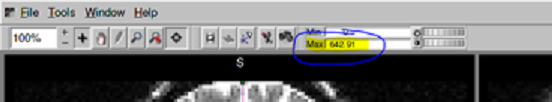
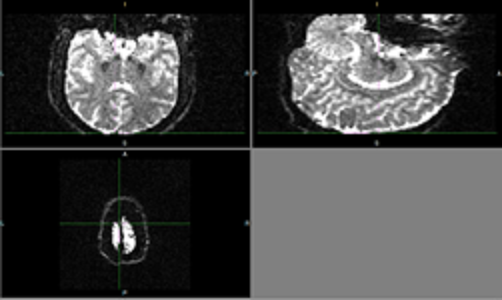
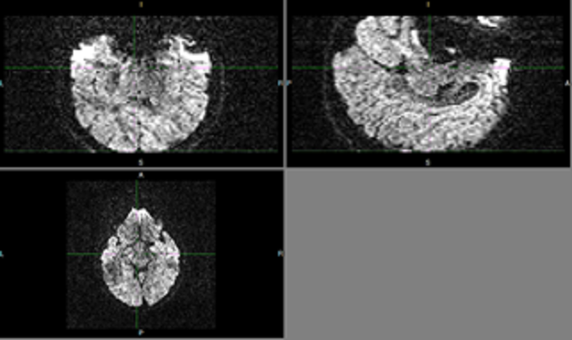
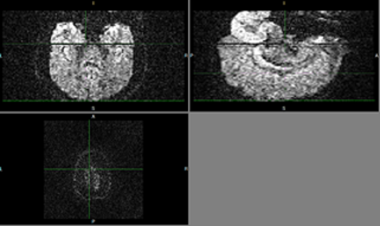

# DTI Quality Control Training 
## Undergraduate Training Resource for DTI Artifact Identification

## Cardinal Rules of Artifact Checking
1. Each ID must have three independent reporters for artifact identification
1. Artifact identification must be done independently! Do not seek the opinion of other artifact reporters who are assigned the same ID. 

## Required resources: 
- Fslview
- High resolustion moniters (laptops and low resolution monitors are not recommended)
- At least 3 lab members to identify artifacts. Recommend 6 RA's work in teams of 2 in order to identify artifacts
- time: RA's will take approximately 1 hour to search for artifacts in a single ID. Budget undergrad workload to account for 3 hours of artifact checking per DTI scan. 

## Documentation: 
- Overall tracking log ([Example Log](https://docs.google.com/a/umich.edu/spreadsheets/d/e/2PACX-1vTq3z7DzsvV2tAtxrhp0SfdU6xvdrfb3DDHucgXizJZxepaFp7ODBb-F5Knvi_5TyKs9VS8b-D1dba0/pubhtml?gid=0&single=true))
    - Permission status: all lab members have read & write access
    
- Artifact Reporter (1,2,3) identified artifacts *insert excel
    - Permission status: read & write access limited to RA(s) assigned to one of the three reporters
    
    
## How to Identify Artifacts (and signal drop out)
- Open Fslview from applications
- In fslview select: File -> Open -> DTI RAW DATA PATH
- Adjust brightness

<!--the below code is how you center an image and add an image--> 

- Check for artifacts by beginning at the bottom of the brain and scrolling up until you have checked each slice, bottom to top

 
- Artifacts will generally look like diagonal, vertical, or horizontal lines running through the brain image.

- Signal drop out, which is th eoverall darkening of a full slice (sometimes fully black sometimes moderately darker). *Note you will often notice dark stripping in the coronal and saggital view

- Check for artifacts within the horizontal plane by beginning at the bottom of the brain and scrolling up (within the sagittal plane)  until you have checked each slice, bottom to top. 
- Check each volume, bottom to top, and record any artifacts found in your RA(1/2/3) found artifacts log *attatch excel log (note private to RA'S assigned RA1, RA2, or RA3)
- Once you have checked all volumes in an ID, place your initials in the DTI artifact tracking log *attatch excel log (note permissions are accessible to all). Do not idicate found artifacts on this log, as it is shared with everyone.
