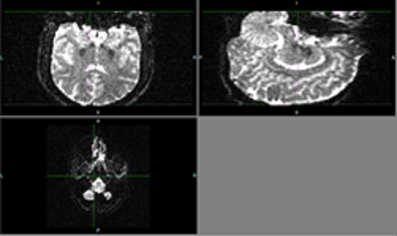

# DTI Quality Control Training 
- Protocol Developed by Kristen Stauffer
- Webpage Developed by Andie Bulbin

## Undergraduate Training Resource for DTI Artifact Identification

## Cardinal Rules of Artifact Checking
1. Each ID must have three independent reporters for artifact identification
1. Artifact identification must be done independently! Do not seek the opinion of other artifact reporters who are assigned the same ID. 

## Required resources: 
- Fslview
- High resolution monitors (laptops and low resolution monitors are not recommended)
- At least 3 lab members to identify artifacts. Recommend 6 RA's work in teams of 2 in order to identify artifacts
- time: RA's will take approximately 1 hour to search for artifacts in a single ID. Budget undergrad workload to account for 3 hours of artifact checking per DTI scan. 

## Documentation: 
- Overall tracking log ([Example Log](https://docs.google.com/spreadsheets/d/e/2PACX-1vSxzCu0iLoKPHfjUIQ4U8b0XRmddBITwl3lmU0p7yyOHU1KJ6huS4SGx6KZfddjeG2HJKbbIGOttc2P/pub?output=xlsx))
    - Permission status: all lab members have read & write access
    
- Artifact Reporter (1,2,3) identified artifacts ([Example Log](https://docs.google.com/spreadsheets/d/e/2PACX-1vR_khA-rgupFDCrYI_BwQ8pNFJB3AxZVUzgOLU1zO9uoOws7NpPhKlzmB8eidODk6oXd4JzEVSYdOxb/pub?output=xlsx))
    - Permission status: read & write access limited to RA(s) assigned to one of the three reporters
    
## How to Identify Artifacts (and signal drop out)
- Open fslview from Applications
- In fslview select: File -> Open -> DTI RAW DATA PATH
- Adjust brightness

- Check for artifacts by beginning at the bottom of the brain and scrolling up until you have checked each slice, bottom to top

 
- Artifacts will generally look like diagonal, vertical, or horizontal lines running through the brain image.

- Signal drop out, which is the overall darkening of a full slice (sometimes fully black sometimes moderately darker)
- NOTE: you will often notice dark striping in the coronal and saggital view

- Check for artifacts within the horizontal plane by beginning at the bottom of the brain and scrolling up (within the sagittal plane)  until you have checked each slice, bottom to top. 
- Check each volume, bottom to top, and record any artifacts found in your [RA(1/2/3) artifacts log](https://docs.google.com/spreadsheets/d/e/2PACX-1vR_khA-rgupFDCrYI_BwQ8pNFJB3AxZVUzgOLU1zO9uoOws7NpPhKlzmB8eidODk6oXd4JzEVSYdOxb/pub?output=xlsx) (note private to RA'S assigned RA1, RA2, or RA3)
- Once you have checked all volumes in an ID, place your initials in the [DTI artifact overall tracking log](https://docs.google.com/spreadsheets/d/e/2PACX-1vSxzCu0iLoKPHfjUIQ4U8b0XRmddBITwl3lmU0p7yyOHU1KJ6huS4SGx6KZfddjeG2HJKbbIGOttc2P/pub?output=xlsx) (note permissions are accessible to all). Do not indicate found artifacts on this log, as it is shared with everyone.
